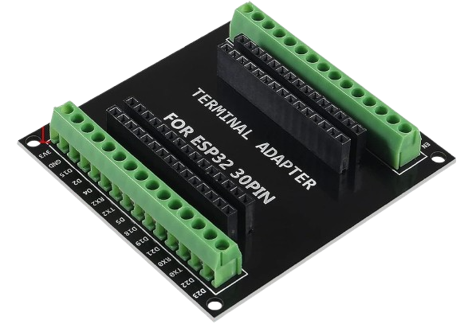
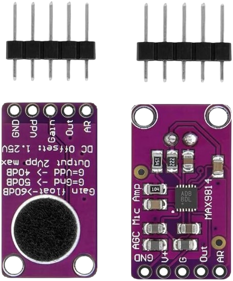
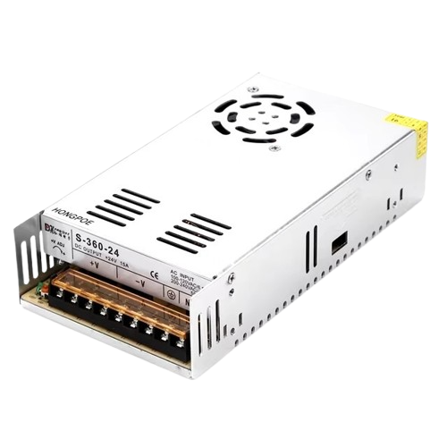
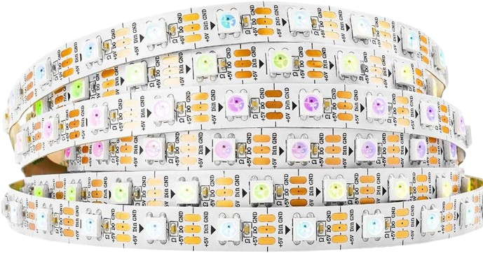
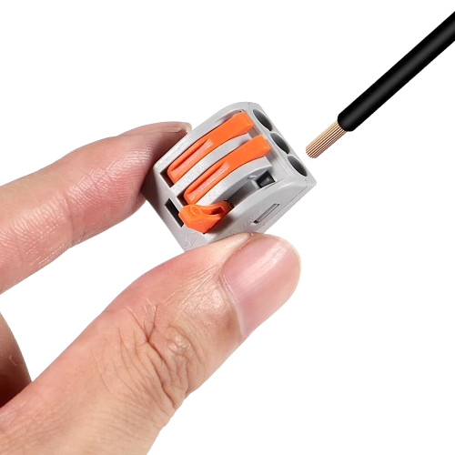
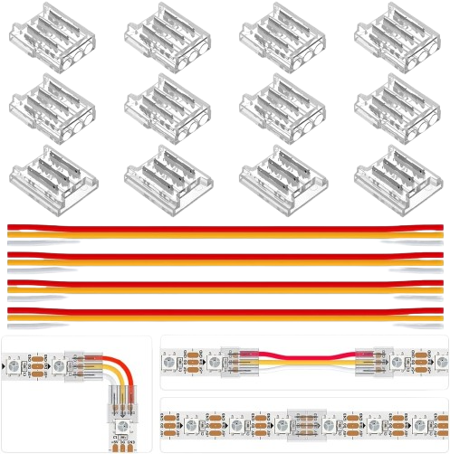
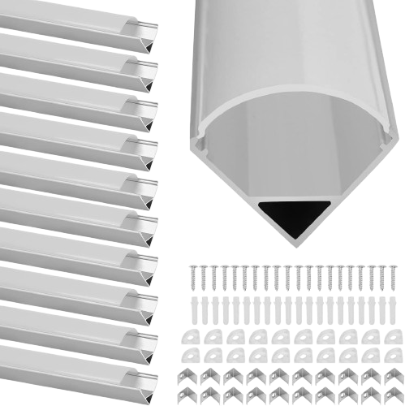
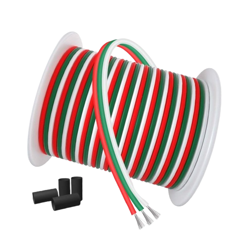

# :microphone:🔉WLED SoundReactiv интилигентна цветомузика

Идеята е в ъглите на помещението да се сложат алуминиеви профили с LED ленти, които да извършват дейност при звук, паралелно, а не последователно. Схемата, която съм изработил е едно към едно с това както съм свързал компонентите.:

> [!WARNING]
> На схемата не е показана дължината на лентата или броят на диодите, понеже това не е от значение.

---

## 📦 Съдържание

- [:microphone:🔉WLED SoundReactiv интилигентна цветомузика](#microphonewled-soundreactiv-интилигентна-цветомузика)
  - [📦 Съдържание](#-съдържание)
  - [:computer: Хардуер:](#computer-хардуер)
    - [Компоненти:](#компоненти)
  - [:alien: Софтуер:](#alien-софтуер)
    - [Инсталиране на WLED: WLED e уеб сървър за управление на NeoPixel (WS2812B, WS2811, SK6812) светодиоди или също SPI базирани чипсети, като WS2801 и APA102! Свържете ESP32 към произволен USB порт на машина с Windows/Linux/MAC за да инсталирате WLED уеб сървър.](#инсталиране-на-wled-wled-e-уеб-сървър-за-управление-на-neopixel-ws2812b-ws2811-sk6812-светодиоди-или-също-spi-базирани-чипсети-като-ws2801-и-apa102-свържете-esp32-към-произволен-usb-порт-на-машина-с-windowslinuxmac-за-да-инсталирате-wled-уеб-сървър)
    - [Конфигуриране/Настройки на WLED:](#конфигурираненастройки-на-wled)
    - [Home-Assistant integration:](#home-assistant-integration)

---

## :computer: Хардуер: 

### Компоненти:
- **ESP32 DEV:** моделът не е от много голямо значение в този проект беше използван ["ESP32 WROOM-32 Entwicklungsboard TYPE-C CH340C/ CP2102" ](https://de.aliexpress.com/item/1005005953505528.html?spm=a2g0o.order_list.order_list_main.20.133b5c5fUUgTke&gatewayAdapt=glo2deu) 

- **ESP32 Adapter:** Предимствата на този ["Terminal Adapter"](https://www.amazon.de/dp/B0CRVHJ9GB?ref=ppx_yo2ov_dt_b_fed_asin_title) са много, ето и някои от тях.:
    - Не е необходимо запояване, а всъщност е здраво и стъбилно.
    - Не се налага да програмирате ["ESP32 WROOM-32 Entwicklungsboard TYPE-C CH340C/ CP2102" ](https://de.aliexpress.com/item/1005005953505528.html?spm=a2g0o.order_list.order_list_main.20.133b5c5fUUgTke&gatewayAdapt=glo2deu) на място, а след програмирането просто го поставяте.
    - Възможност за тестване с повече от един чип (докато всичко си работи можете да си поиграете с настройките върху др. чип и просто да ги размените).
    - Предотвратява допир на два пина.
    - Удобно за направата на мост между два пина.
    
     

    

- **Микрофон:** [MAX9814](https://www.amazon.de/dp/B0D3X6K7BW?ref=ppx_yo2ov_dt_b_fed_asin_title) е идеалният избор за този проект, но той може да бъде заменен и с друг вид.:

    
    
    :warning: Преди да включите захранването се уверете, че кабелите водещи до микрофонът са точн, както на схемата най-горе и не контактуват помежду си. В противен случай микрофонът изгаря и става негоден за употреба. Можете да проверите това с мултицет. Четирите канала на микрофона не трябва да контактуват, ако те контактуват търсете проблемът в споиките или вече той е изгорял. 

- **Захранване:** то би могло да бъде и друго, в този проект ползвах ["vusum Schalt-LED-Netzteil, 5-V-Netzteil, Transformator"](https://de.aliexpress.com/item/1005005616440560.html?spm=a2g0o.order_list.order_list_main.4.133b5c5fQtV6NX&gatewayAdapt=glo2deu). 

    

    :warning:Да работи на 5 волта и мощността му да не е по-малка от тази на лед лентите, които ще захранва. Както се вижда в обявата цената между 150W-350W не e много голяма. Моят съвет е да вземете максимално голямата мощност. Понеже така или иначе ще изразходва само това, което консумират LED-лентите, а не повече.:

- **LED лента:** за този проект избрах [Individually Addressable Led Strip,5m 300Pixels 5V Led](https://www.amazon.de/gp/product/B01CDTEG1O/ref=ppx_yo_dt_b_search_asin_title?ie=UTF8&th=1).:

    

    :warning:Изборът на LED лента е строго идивидуален. В моят случай ми трябваха 4 ленти по 2,3 метра и избрах две ленти по 5 метра с максимален брой диоди на нея, за да се постигне максимален ефект.

    
- **Други:** за проекта бяха нужни и [LED-конектори](https://www.amazon.de/gp/product/B094NJLKFH/ref=ppx_yo_dt_b_search_asin_image?ie=UTF8&psc=1) ,[кабели](https://www.amazon.de/gp/product/B08JTZKN4M/ref=ppx_yo_dt_b_search_asin_title?ie=UTF8&psc=1) ,[ъглови алуминеви профили](https://www.amazon.de/gp/product/B0BG8L6D8Q/ref=ppx_yo_dt_b_search_asin_title?ie=UTF8&psc=1) и [клемореди](https://de.aliexpress.com/item/1005006918394384.html?spm=a2g0o.order_list.order_list_main.151.133b5c5fQtV6NX&gatewayAdapt=glo2deu) 

    
    
    
    

> [!WARNING]
> Внимавайте при закупуването на [LED лентата](https://www.amazon.de/gp/product/B01CDTEG1O/ref=ppx_yo_dt_b_search_asin_title?ie=UTF8&th=1) и  [Захранването](https://de.aliexpress.com/item/1005005616440560.html?spm=a2g0o.order_list.order_list_main.4.133b5c5fQtV6NX&gatewayAdapt=glo2deu). Трябва да работят задължително на 5 Волта, понеже и [ESP32](https://de.aliexpress.com/item/1005005953505528.html?spm=a2g0o.order_list.order_list_main.20.133b5c5fUUgTke&gatewayAdapt=glo2deu) работи на толкова. [Микрофонът](https://www.amazon.de/dp/B0D3X6K7BW?ref=ppx_yo2ov_dt_b_fed_asin_title) трябва да работи на 3 Волта или в този диапазон, но не и повече от 5 Волта.

## :alien: Софтуер: 

### Инсталиране на WLED: WLED e уеб сървър за управление на NeoPixel (WS2812B, WS2811, SK6812) светодиоди или също SPI базирани чипсети, като WS2801 и APA102! Свържете [ESP32](https://de.aliexpress.com/item/1005005953505528.html?spm=a2g0o.order_list.order_list_main.20.133b5c5fUUgTke&gatewayAdapt=glo2deu) към произволен USB порт на машина с Windows/Linux/MAC за да инсталирате WLED уеб сървър.
- [Драивър VCP Drivers:](https://www.silabs.com/developer-tools/usb-to-uart-bridge-vcp-drivers?tab=downloads) след инсталацията рестартирайте операционната система преди да продължите.
- [Флаш софтуер:](https://github.com/xyzroe/ZigStarGW-MT/releases/).: непретенциозен и лесен за употреба.

  

- [WEB Flash](https://tasmota.github.io/install/): удобна функция за инсталиране на "bin" файлове предоставена от Tasmota.
- [WLED уеб сървър:](https://github.com/Bacard1/Home-Assistant-Bulgaria/raw/refs/heads/main/Statik/Projekts/Home-Assistant-WLED-SoundReactive/bin/WLEDMM_0.14.0-b15.21_athom_music_esp32_4MB_M.bin)
  
> [!WARNING]
> Използвайте точно този файл, понеже е модификация и работи прекрасно с [ESP32](https://de.aliexpress.com/item/1005005953505528.html?spm=a2g0o.order_list.order_list_main.20.133b5c5fUUgTke&gatewayAdapt=glo2deu) и е компактивен с всички операционни системи. Не се тревожете за версията тя ще бъде подменена от мен, ако има по нова такава. 

### Конфигуриране/Настройки на WLED:
- **Настройки на Wi-Fi мрежата:** тази настройка не е задължителна, въпрос на вкус.

    

- **Настройки на LED лентата:** пребройте точно LED диодите, по това се подразбира, че всяка една лента трябва да е с еднакъв брой диоди.

    

- **Настройки на микрофонът:**

    

### Home-Assistant integration: 

> [!WARNING]
> Ако "Home Assistent" ви препоръча нова версия на WLED я пропоснете. В противен случай, ще загубите опциите си за настройване на микрофон.

> [!TIP]
> Ако този проект ви е харесъл, [ТУК](https://github.com/Bacard1?tab=repositories) ще намерите още интересни гранилища направени от мен. 
> Ако срещате затруднения или имате въпроси не се колебайте да се свържете с мен.