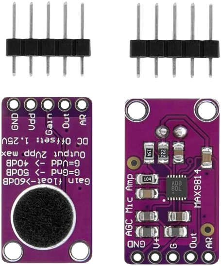
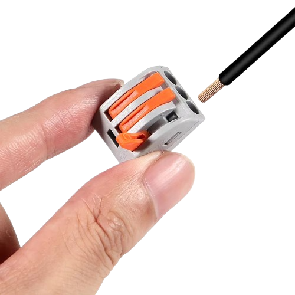
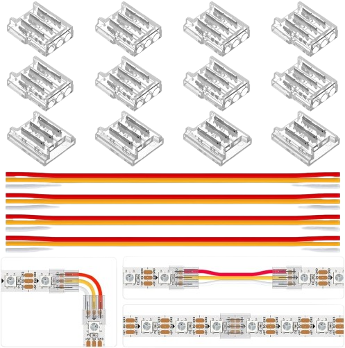
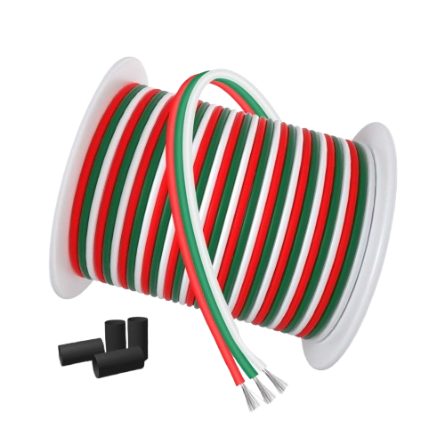

# 🎤🔉WLED SoundReactiv Intelligent Light and Sound Show

The idea is to place aluminum profiles with LED strips in the corners of the room, which react to sound in parallel, not sequentially. The schematic I've made is exactly the same as how I've connected the components.

> [!WARNING]
> The schematic does not show the length of the strip or the number of LEDs, as this is not important.

---

## 📦 Contents

- [🎤🔉WLED SoundReactiv Intelligent Light and Sound Show](#wled-soundreactiv-intelligent-light-and-sound-show)
  - [📦 Contents](#-contents)
  - [💻 Hardware:](#-hardware)
    - [Components:](#components)
  - [👽 Software:](#-software)
    - [Installing WLED:](#installing-wled)
    - [Configuring WLED:](#configuring-wled)
    - [Home-Assistant integration:](#home-assistant-integration)

---

## 💻 Hardware: 

### Components:
- **ESP32 DEV:** the model isn't very important; in this project, the ["ESP32 WROOM-32 Entwicklungsboard TYPE-C CH340C/ CP2102"](https://de.aliexpress.com/item/1005005953505528.html?spm=a2g0o.order_list.order_list_main.20.133b5c5fUUgTke&gatewayAdapt=glo2deu) was used. 

- **ESP32 Adapter:** The advantages of this ["Terminal Adapter"](https://www.amazon.de/dp/B0CRVHJ9GB?ref=ppx_yo2ov_dt_b_fed_asin_title) are many. Here are a few:
  - No soldering required, yet stable and solid.
  - You don't have to program the ["ESP32 WROOM-32 Entwicklungsboard TYPE-C CH340C/ CP2102"](https://de.aliexpress.com/item/1005005953505528.html?spm=a2g0o.order_list.order_list_main.20.133b5c5fUUgTke&gatewayAdapt=glo2deu) in place—just slot it in after programming.
  - Allows testing with multiple chips (while one works, you can tweak settings on another and swap them).
  - Prevents pin shorting.
  - Convenient for bridging two pins.
    
     

    

- **Microphone:** [MAX9814](https://www.amazon.de/dp/B0D3X6K7BW?ref=ppx_yo2ov_dt_b_fed_asin_title) is the ideal choice for this project, but can be replaced by other types.

    
 
> [!WARNING]
> Before powering on, make sure the wires going to the microphone are exactly as in the schematic above and are not touching each other. Otherwise, the microphone will burn out and become unusable. You can verify this with a multimeter. The four channels of the microphone must not short—if they do, check the solder joints or assume it's already damaged.

- **Power Supply:** You can use something else, but for this project I used ["vusum Schalt-LED-Netzteil, 5-V-Netzteil, Transformator"](https://de.aliexpress.com/item/1005005616440560.html?spm=a2g0o.order_list.order_list_main.4.133b5c5fQtV6NX&gatewayAdapt=glo2deu). 

    

> [!WARNING]
> It must operate at 5V and provide at least the power required by the LED strips. As you can see in the listing, the price difference between 150W and 350W isn't large. My advice: get the highest wattage possible. The PSU will only deliver as much as the LEDs consume—no more.

- **LED Strip:** For this project I chose [Individually Addressable Led Strip,5m 300Pixels 5V Led](https://www.amazon.de/gp/product/B01CDTEG1O/ref=ppx_yo_dt_b_search_asin_title?ie=UTF8&th=1).

    

> [!WARNING]
> Choosing an LED strip is highly individual. In my case, I needed 4 strips of 2.3 meters each, so I chose two 5-meter strips with the maximum number of LEDs to achieve the strongest effect.

    
- **Other:** This project also required [LED connectors](https://www.amazon.de/gp/product/B094NJLKFH/ref=ppx_yo_dt_b_search_asin_image?ie=UTF8&psc=1), [wires](https://www.amazon.de/gp/product/B08JTZKN4M/ref=ppx_yo_dt_b_search_asin_title?ie=UTF8&psc=1), [angled aluminum profiles](https://www.amazon.de/gp/product/B0BG8L6D8Q/ref=ppx_yo_dt_b_search_asin_title?ie=UTF8&psc=1), and [terminal blocks](https://de.aliexpress.com/item/1005006918394384.html?spm=a2g0o.order_list.order_list_main.151.133b5c5fQtV6NX&gatewayAdapt=glo2deu) 

    
    
    
    

> [!WARNING]
> Be careful when buying the [LED strip](https://www.amazon.de/gp/product/B01CDTEG1O/ref=ppx_yo_dt_b_search_asin_title?ie=UTF8&th=1) and [power supply](https://de.aliexpress.com/item/1005005616440560.html?spm=a2g0o.order_list.order_list_main.4.133b5c5fQtV6NX&gatewayAdapt=glo2deu). They must operate at 5V, since the [ESP32](https://de.aliexpress.com/item/1005005953505528.html?spm=a2g0o.order_list.order_list_main.20.133b5c5fUUgTke&gatewayAdapt=glo2deu) also uses 5V. The [microphone](https://www.amazon.de/dp/B0D3X6K7BW?ref=ppx_yo2ov_dt_b_fed_asin_title) should run on 3V or within that range—but not over 5V.

## 👽 Software: 

### Installing WLED:  
WLED is a web server for controlling NeoPixel (WS2812B, WS2811, SK6812) LEDs or also SPI-based chipsets like WS2801 and APA102! Connect the [ESP32](https://de.aliexpress.com/item/1005005953505528.html?spm=a2g0o.order_list.order_list_main.20.133b5c5fUUgTke&gatewayAdapt=glo2deu) to any USB port of a Windows/Linux/MAC machine to install the WLED web server.
- [VCP Drivers:](https://www.silabs.com/developer-tools/usb-to-uart-bridge-vcp-drivers?tab=downloads) reboot your system after installation.
- [Flash software:](https://github.com/xyzroe/ZigStarGW-MT/releases/): simple and easy to use.
- [WEB Flash](https://tasmota.github.io/install/): a convenient method to flash “.bin” files provided by Tasmota.
- [WLED web server binary:](https://github.com/Bacard1/Home-Assistant-Bulgaria/raw/refs/heads/main/Statik/Projekts/Home-Assistant-WLED-SoundReactive/bin/WLEDMM_0.14.0-b15.21_athom_music_esp32_4MB_M.bin)
  
> [!WARNING]
> Use this specific file, as it’s modified and works flawlessly with [ESP32](https://de.aliexpress.com/item/1005005953505528.html?spm=a2g0o.order_list.order_list_main.20.133b5c5fUUgTke&gatewayAdapt=glo2deu), and is compatible with all OSs. Don’t worry about versioning—I’ll update it if there’s a newer one. 

### Configuring WLED:
- **Wi-Fi network settings:** this is optional, a matter of preference.

    

- **LED strip settings:** count the exact number of LEDs; each strip must have the same number.

    

- **Microphone settings:**

    

### Home-Assistant integration: 

> [!WARNING]
> If "Home Assistant" suggests updating WLED, skip it. Otherwise, you'll lose your microphone configuration options.

> [!TIP]
> If you liked this project, [HERE](https://github.com/Bacard1?tab=repositories) you’ll find more interesting creations by me.  
> If you have questions or need help, feel free to contact me.
