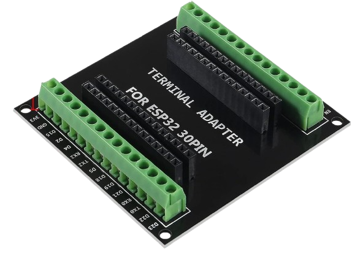
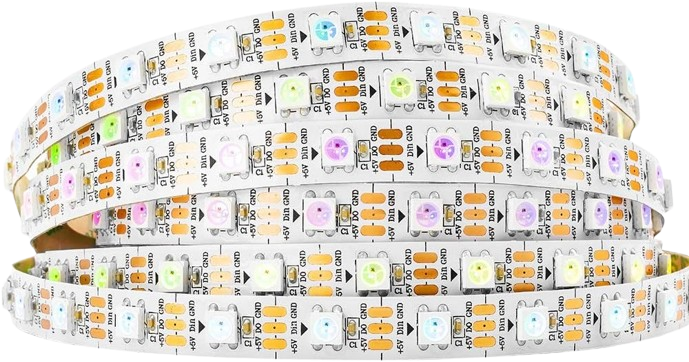

# :microphone:🔉WLED SoundReactiv Intiligent flowermouth

The idea is to put aluminum profiles in the corners of the room with LED strips to perform sound in parallel, not consistent.The scheme I have made is one -to -one with that I have connected the components:

> [!WARNING]
> The scheme does not show the length of the strip or the number of diodes, because it does not matter.

---

## 📦 Content

- [:microphone:🔉WLED SoundReactiv Intiligent flowermouth](#microphonewled-soundreactiv-intiligent-flowermouth)
  - [📦 Content](#-content)
  - [:computer: Hardware:](#computer-hardware)
    - [Component:](#component)
  - [:alien: Software:](#alien-software)
    - [Installation of WLED: WLED is a web server for management of Neopixel (WS2812B, WS2811, SK6812) LEDs or also SPI based chipsets such as WS2801 and APA102!Connect ESP32 To any USB port on a Windows/Linux/Mac machine to install a WLED web server.](#installation-of-wled-wled-is-a-web-server-for-management-of-neopixel-ws2812b-ws2811-sk6812-leds-or-also-spi-based-chipsets-such-as-ws2801-and-apa102connect-esp32-to-any-usb-port-on-a-windowslinuxmac-machine-to-install-a-wled-web-server)
    - [WLED configuration/settings:](#wled-configurationsettings)
    - [Home-Assistant integration:](#home-assistant-integration)

---

## :computer: Hardware: 

### Component:
- **ESP32 DEV:** The model is not very important in this project was used ["ESP32 WROOM-32 Entwicklungsboard TYPE-C CH340C/ CP2102" ](https://de.aliexpress.com/item/1005005953505528.html?spm=a2g0o.order_list.order_list_main.20.133b5c5fUUgTke&gatewayAdapt=glo2deu) 

- **ESP32 Adapter:** The benefits of this ["Terminal Adapter"](https://www.amazon.de/dp/B0CRVHJ9GB?ref=ppx_yo2ov_dt_b_fed_asin_title) are many, here are some of them:
  - There is no need for soldering, but in fact it is healthy and stem.   
  - You do not have to program ["ESP32 WROOM-32 Entwicklungsboard TYPE-C CH340C/ CP2102" ](https://de.aliexpress.com/item/1005005953505528.html?spm=a2g0o.order_list.order_list_main.20.133b5c5fUUgTke&gatewayAdapt=glo2deu) On the spot, and after programming you just put it.
  - Testing with more than one chip (while everything works, you can play with the settings on the other chip and just exchange them).
  - Prevents two pins from touching.
  - Convenient for making a bridge between two pins.   

- **Microphone:** [MAX9814](https://www.amazon.de/dp/B0D3X6K7BW?ref=ppx_yo2ov_dt_b_fed_asin_title) is the perfect choice for this project, but it can also be replaced by another kind.:

    

> [!WARNING]
> Before turning on the power, make sure that the cables leading to the microphone are accurate, as on the scheme at the top and do not contact each other.Otherwise, the microphone burns and becomes unfit for use.You can check this with a multimeter.The four grooves of the microphone should not contact if they are in contact, look for the problem in the solders or it is already burned.

- **Power:** It could be otherwise in this project I used ["vusum Schalt-LED-Netzteil, 5-V-Netzteil, Transformator"](https://de.aliexpress.com/item/1005005616440560.html?spm=a2g0o.order_list.order_list_main.4.133b5c5fQtV6NX&gatewayAdapt=glo2deu). 

    

> [!WARNING]
> To operate at 5 volts and its power is not less than that of the ice strips it will feed.As you can see in the advertisement, the price between 150W-350W is not very large.My advice is to get the maximum power.Because anyway it will only consume what the LED strips consume, not more.:

- **LED tape:** I chose for this project [Individually Addressable Led Strip,5m 300Pixels 5V Led](https://www.amazon.de/gp/product/B01CDTEG1O/ref=ppx_yo_dt_b_search_asin_title?ie=UTF8&th=1).:

    

> [!WARNING]
> The choice of LED strip is strictly idiDid.In my case, I needed 4 strips of 2.3 meters and I chose two strips of 5 meters with a maximum number of diodes on it to maximize effect.

    
- **Other:** The project was needed and [LED-connectors](https://www.amazon.de/gp/product/B094NJLKFH/ref=ppx_yo_dt_b_search_asin_image?ie=UTF8&psc=1) ,[cables](https://www.amazon.de/gp/product/B08JTZKN4M/ref=ppx_yo_dt_b_search_asin_title?ie=UTF8&psc=1) ,[corner aluminum profiles](https://www.amazon.de/gp/product/B0BG8L6D8Q/ref=ppx_yo_dt_b_search_asin_title?ie=UTF8&psc=1) и [Clemodred](https://de.aliexpress.com/item/1005006918394384.html?spm=a2g0o.order_list.order_list_main.151.133b5c5fQtV6NX&gatewayAdapt=glo2deu) 

    
    
    
    

> [!WARNING]
> Be careful when buying [LED strip](https://www.amazon.de/gp/product/B01CDTEG1O/ref=ppx_yo_dt_b_search_asin_title?ie=UTF8&th=1) и  [Power](https://de.aliexpress.com/item/1005005616440560.html?spm=a2g0o.order_list.order_list_main.4.133b5c5fQtV6NX&gatewayAdapt=glo2deu). Have to work at 5 volts, because and [ESP32](https://de.aliexpress.com/item/1005005953505528.html?spm=a2g0o.order_list.order_list_main.20.133b5c5fUUgTke&gatewayAdapt=glo2deu) Works so much. [The microphone](https://www.amazon.de/dp/B0D3X6K7BW?ref=ppx_yo2ov_dt_b_fed_asin_title) It must operate at 3 volts or in this range, but not more than 5 volts.

## :alien: Software: 

### Installation of WLED: WLED is a web server for management of Neopixel (WS2812B, WS2811, SK6812) LEDs or also SPI based chipsets such as WS2801 and APA102!Connect [ESP32](https://de.aliexpress.com/item/1005005953505528.html?spm=a2g0o.order_list.order_list_main.20.133b5c5fUUgTke&gatewayAdapt=glo2deu) To any USB port on a Windows/Linux/Mac machine to install a WLED web server.
- [Driver VCP Drivers:](https://www.silabs.com/developer-tools/usb-to-uart-bridge-vcp-drivers?tab=downloads) After installation, restart the operating system before continuing.
- [Flash software:](https://github.com/xyzroe/ZigStarGW-MT/releases/).: unpretentious and easy to use.
- [WEB Flash](https://tasmota.github.io/install/): Convenient feature for installing "BIN" files provided by Tasmota.
- [WLED web server:](https://github.com/Bacard1/Home-Assistant-Bulgaria/raw/refs/heads/main/Statik/Projekts/Home-Assistant-WLED-SoundReactive/bin/WLEDMM_0.14.0-b15.21_athom_music_esp32_4MB_M.bin)
  
> [!WARNING]
> Use exactly this file because it is a modification and works great with [ESP32](https://de.aliexpress.com/item/1005005953505528.html?spm=a2g0o.order_list.order_list_main.20.133b5c5fUUgTke&gatewayAdapt=glo2deu)And it is compact with all operating systems.Do not worry about the version it will be replaced by me if there is a new one.

### WLED configuration/settings:
- **Wi-Fi Settings:** This setting is optional, a matter of taste.

    

- **LED strip settings:** Count the LED diodes exactly, it is implied that each lane should have the same number of diodes.
- 
    

- **The microphone settings:**

    

### Home-Assistant integration: 

> [!WARNING]
>If "Home Assastet" recommends you a new version of WLED.Otherwise, you will lose your microphone adjustment options.

> [!TIP]
> If you like this project, [Here](https://github.com/Bacard1?tab=repositories) You will find more interesting borders made by me.  
> If you have difficulty or have questions, do not hesitate to contact me.